<!--
Render this deck with Marp:
  npx @marp-team/marp-cli docs/demo-debugging-at-scale.md --html -o demo.html
  npx @marp-team/marp-cli docs/demo-debugging-at-scale.md --pdf
Or just read it top-to-bottom — every slide is a self-contained talking point.
Slides are separated by `---`. Speaker notes live in HTML comments.
-->

# Debugging ROCm at Scale

## with **mirage** + **rocjitsu**

*Run real ROCm workloads on emulated GPUs — no hardware required.*

<!--
Hook: "Today I'll show how we debug multi-node ROCm jobs on a laptop, with
zero physical GPUs, using mirage as the UX over the rocjitsu emulator."
-->

---

# The problem

Debugging GPU code at scale is **expensive and slow**:

- 🖥️  You need the **actual hardware** — MI300X / MI350X / MI450X.
- 🌐  Multi-node bugs (RCCL collectives, rank coordination) need a **whole cluster**.
- 🔁  Repro is flaky; the cluster is shared; the queue is long.
- 🔬  When it crashes at 2am on node 47, you get a core dump and a prayer.

> **What if every engineer could spin up a 2-node MI450X "cluster" on their laptop,
> run it like any other command, and re-run instantly?**

That is what **mirage + rocjitsu** does.

---

# Two pieces, one story

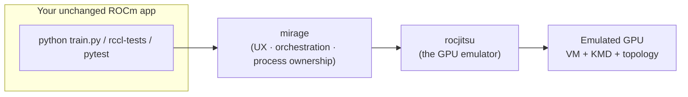

| Layer | What it is |
| ----- | ---------- |
| **rocjitsu** | The ROCm Just-In-time Suite — a software GPU **emulator** (functional or clocked). |
| **mirage** | The user-facing **UX**: one CLI that drives rocjitsu (and other backends) at scale. |

<!--
Key framing: rocjitsu is the engine, mirage is the cockpit. The app never changes.
-->

---

# rocjitsu in one slide

A real ROCm app expects a real kernel driver (`/dev/kfd`) and a real GPU.
rocjitsu **fakes both** so the app runs unmodified.

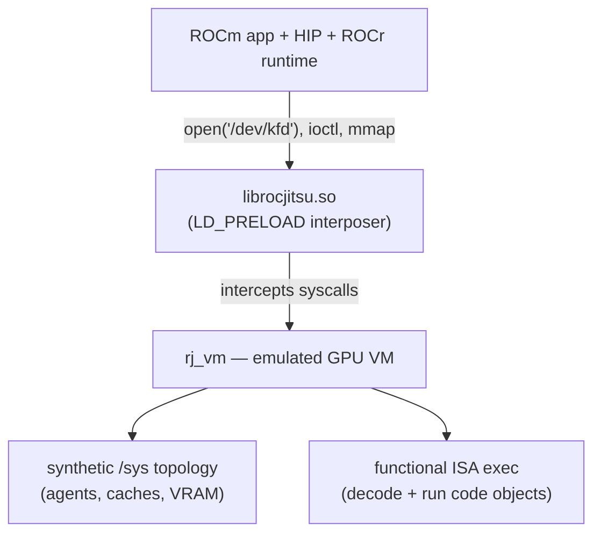

- **No `/dev/kfd`?** The interposer synthesizes the whole kernel interface.
- **No GPU?** `rj_vm` models the device, its topology, and executes the ISA.
- The app sees a normal MI350X. It is software, all the way down.

---

# mirage core concepts

Six nouns. Learn these and you know the tool.

| Concept | What it is |
| ------- | ---------- |
| **Emulator** | A backend that runs GPU code: `rocjitsu`, `rocjitsu-dbt`, `hotswap`. |
| **Agent** | A hardware GPU definition — `MI300X`, `MI350X`, `MI450X`. |
| **Topology** | A rack / node / GPU layout that references an agent. |
| **Profile** | A reusable preset: emulator + topology + options. |
| **Session** | The emulated cluster **one `mirage run` holds in its own process**. It exists exactly as long as that command does. |
| **Exec** | A command started in a live run's session from **another terminal**, running in *that* terminal. |

> Flow: pick a **profile** → `mirage run` it → optionally `mirage exec` into it
> from a second window while it's up.

---

# The 30-second demo

```console
$ mirage emulators
NAME          INSTALLED  SUPPORTED  DESCRIPTION
rocjitsu*     yes        yes        ROCm just-in-time GPU emulator
rocjitsu-dbt  yes        no         dynamic binary translation (needs real GPU)
hotswap       no         yes        load-time ISA-rewriting backend
* = default emulator for new profiles

$ mirage profile create cdna4 --emulator rocjitsu --agent MI350X
created profile cdna4

$ mirage run --profile cdna4 -- python3 train.py
mirage: session s-20260616-191636-3b41-0
tiny_torch_ok
```

That last line came out of an **emulated MI350X**. No GPU was harmed.

<!--
Pause here. This is the "wow" — a torch workload on a laptop on a fake GPU.
The session id on stderr is the only thing mirage prints of its own.
-->

---

# Architecture: one binary, one process

There is no server. `mirage run` **is** the runtime: it brings a session up in
its own address space, runs your command, and takes the session with it when it
exits.

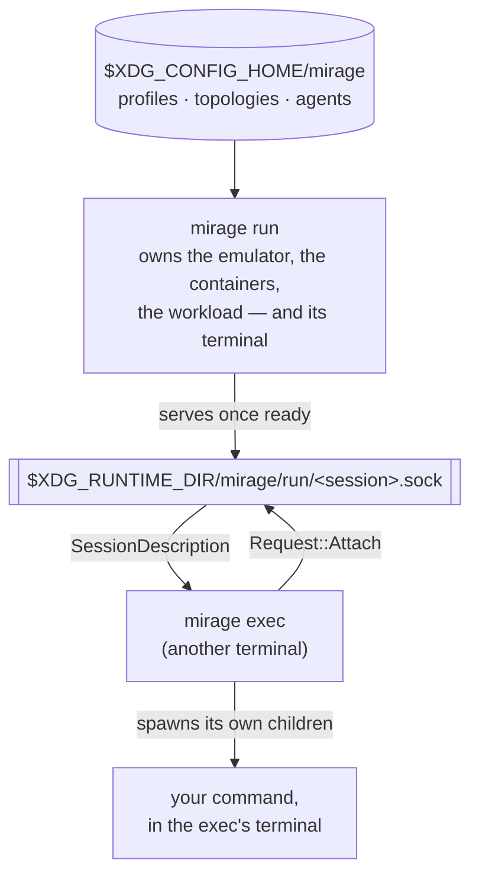

> The socket answers exactly **one** question: *how do I start a process in this
> session?* Everything else — spawning, signalling, reaping, printing — belongs
> to the process that owns the terminal it is happening in.

---

# Why no daemon? (this is the debugging superpower)

Mirage used to have a supervisor daemon owning every session; before that, a
detached per-session host coordinating through files. Both leaked, for the same
reason: **a process nobody is responsible for is a process nobody reaps.**

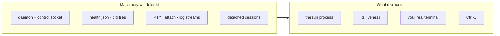

- **Liveness is a fact, not an inference** — "is this session alive?" is "is that
  process alive?". No heartbeat, no staleness ladder, no guessing.
- **Teardown is closed-loop** — the run does not exit until every child is waited
  on and every container is removed.
- **The socket *is* the registration** — connecting either reaches the owner or
  fails, and failing is how a stale entry is recognised.

---

# The crate map

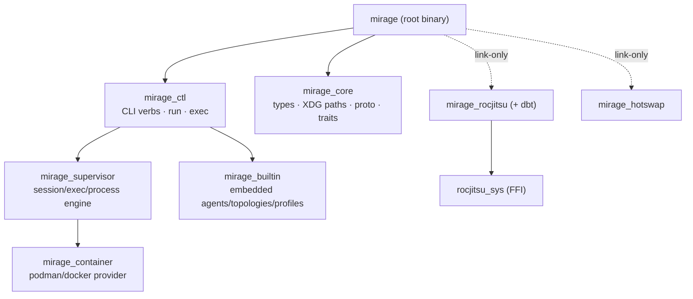

Backends are **link-only** — they self-register via `inventory`. Turn a
Cargo feature on/off and the backend appears/disappears from `mirage emulators`.
The binary never names a backend.

```console
$ cargo build --no-default-features --features rocjitsu
```

---

# The emulator backends

| Backend | How it runs GPU code | When to use |
| ------- | -------------------- | ----------- |
| **rocjitsu** | Pure software emulation. Synthesizes `/dev/kfd`, runs the ISA in `rj_vm`. | Debug anywhere — no GPU needed. **The headline.** |
| **rocjitsu-dbt** | Dynamic Binary Translation: translates guest ISA → host GPU ISA, runs on real HW. | You *have* a GPU but want a *different* arch. |
| **hotswap** | Load-time ISA rewriting. | Quick arch retargeting on real HW. |

All three share the **same** mirage UX. Switching is one flag:

```console
$ mirage run --profile cdna4 --emulator rocjitsu-dbt -- ./app
```

---

# Inside rocjitsu: the KMD interposer

`librocjitsu.so` is `LD_PRELOAD`-ed into the workload and hooks libc.

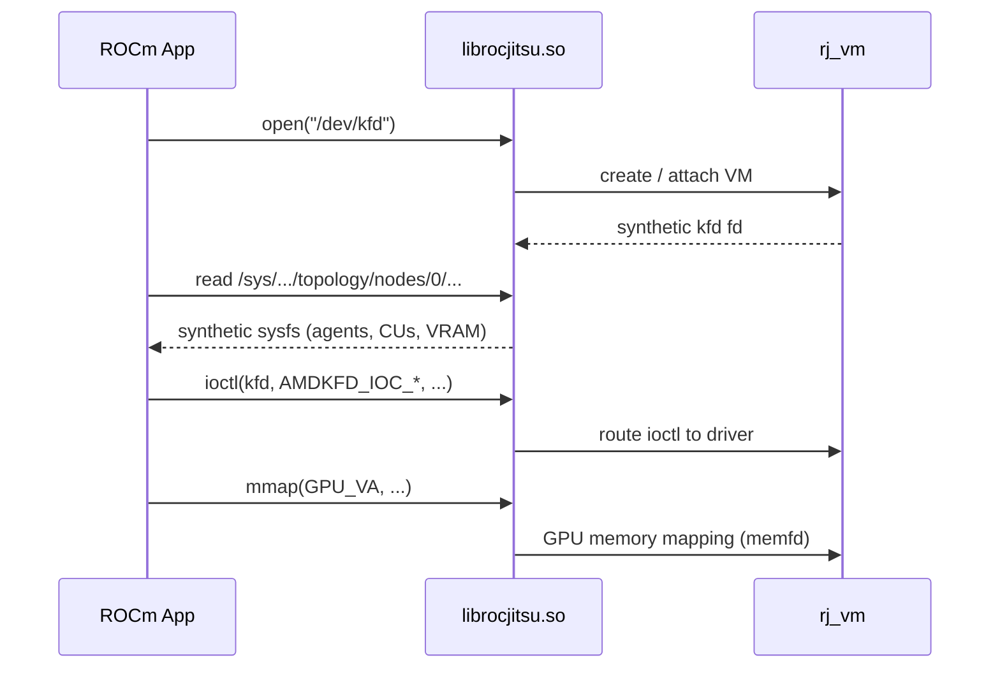

Hooked calls: `open`/`openat`, `mmap`/`munmap`, `ioctl`, `stat`, `dlsym`,
DRM + amdgpu APIs. The app thinks it's talking to a kernel driver.

---

# rocjitsu: daemon mode vs in-process mode

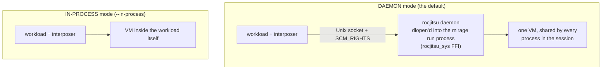

- **Daemon (default)** — the VM lives in the `mirage run` process; every workload's
  interposer connects to `$ROCJITSU_RUNTIME_DIR/daemon.sock`. GPU memory is shared
  via **memfds / SCM_RIGHTS**. `--daemon` is accepted for explicitness.
- **In-process** — one VM per workload process, no sharing. Multi-GPU RCCL
  collectives therefore need the daemon.
- No separate rocjitsu CLI is involved, and no daemon outlives the run: it is
  stopped, and its socket unlinked, on the way out.

---

# Topology: modeling the rack

A topology is just a rack / node / GPU layout that references an agent.

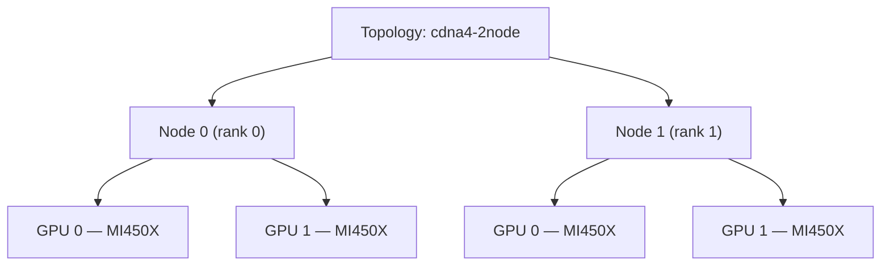

```console
$ mirage topology create cdna4-2node --agent MI450X --num-nodes 2 --gpus-per-node 2
created topology cdna4-2node

$ mirage topology show cdna4-2node | jq '{nodes:.num_nodes, gpus:.gpus_per_node, agent:.agent}'
{ "nodes": 2, "gpus": 2, "agent": "MI450X" }
```

A **profile** binds this topology to an emulator + options. `mirage run` can
override the counts for one run with `--num-nodes` / `--gpus-per-node`.

---

# Startup: how a run brings the cluster up

The logical topology (nodes × GPUs) maps **1 node → 1 process** (or one container
per node). One `mirage run` owns all of it, and one rocjitsu daemon — hosted
inside that same process — serves every node's emulated GPUs.

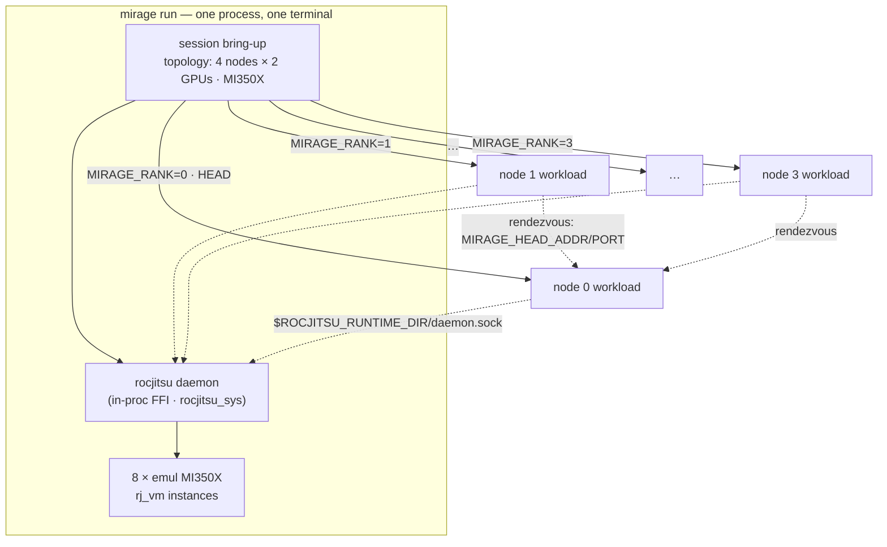

- One workload **process per node** — or `--nproc-per-node` of them, each with
  its own `RANK` and `LOCAL_RANK` and a shared `WORLD_SIZE`.
- Rank 0 is the **head**; every other node rendezvouses to it for collectives.
- Every node points at the **same** daemon socket, so the emulated GPUs are one
  shared device fabric rather than N isolated ones.

---

# Startup at scale: 32 nodes × 8 GPUs

Same shape, more nodes. A `32 × 8` topology fans out to **32 emulated nodes**
backed by **256 emulated GPUs** — one run process, one command, one Ctrl-C.

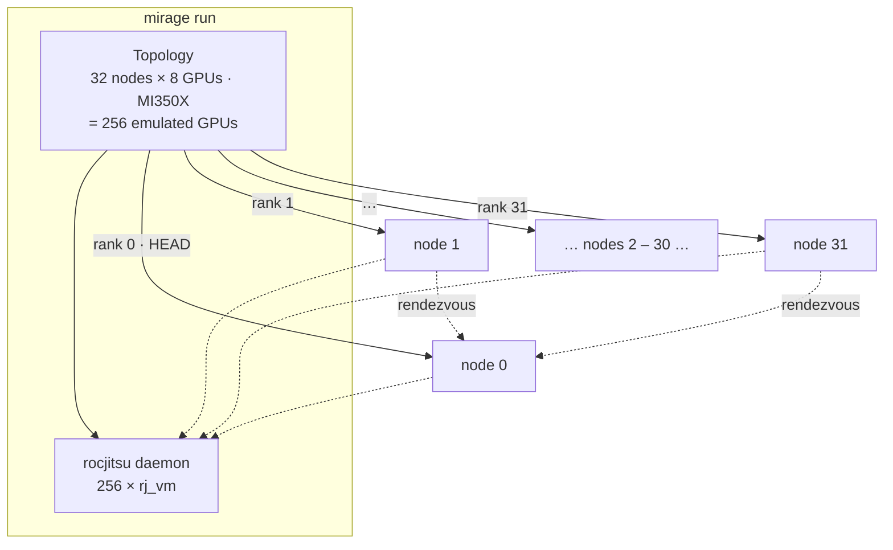

```console
$ mirage profile create super --emulator rocjitsu --agent MI350X \
      --num-nodes 32 --gpus-per-node 8
$ mirage run --profile super -- ./all_reduce_perf -b 8 -e 1G
```

> The bring-up pattern is identical to one node, just replicated per rank —
> and so is the teardown, which is what stops 32 nodes from becoming 32 leaks.

---

# Containerization: one container per node

When a profile requests an image, the run brings up one container per node,
bind-mounts the session scratch directory into each, and launches workloads into
them through the provider's `exec`.

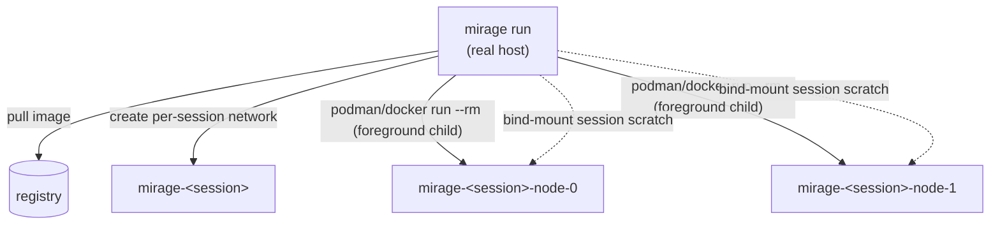

- Provider auto-detected: **podman** or **docker** (`--container-provider`, or
  `MIRAGE_CONTAINER_PROVIDER`, to force).
- Containers are **not detached**. Each provider client is a child process mirage
  owns: kill it and the container stops, and `--rm` removes it.
- The container's foreground process is `sleep infinity`; workloads go in via
  `provider exec -i` — plus `-t` for an interactive one-process exec on a real
  terminal, since `provider exec` gives the in-container process pipes rather
  than your descriptors.
- podman gets `--group-add keep-groups`; docker gets explicit `/dev/kfd` + render
  nodes and the named GPU groups.

---

# Rank & head-node coordination

Every workload process is handed its place in the job. Mirage's variables are
applied **last**, so a workload cannot break its own rendezvous by exporting
`RANK` or `WORLD_SIZE` itself.

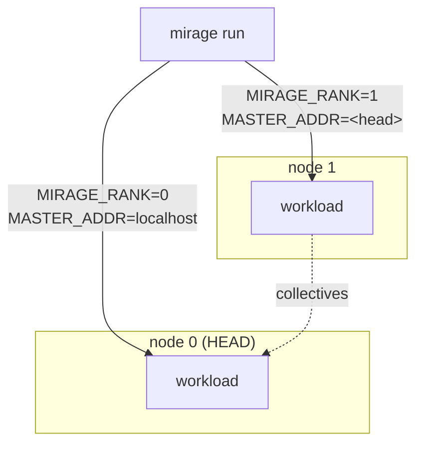

| Variable | Meaning |
| -------- | ------- |
| `MIRAGE_RANK` | This node's rank (0 = head). |
| `RANK` / `LOCAL_RANK` / `WORLD_SIZE` | Per-process torch/RCCL identity across the whole job. |
| `MIRAGE_HEAD_ADDR` / `MIRAGE_HEAD_PORT` | Where rank 0 lives. Mirrored as `MASTER_ADDR` / `MASTER_PORT` so `torch.distributed` initialises with no launcher. |
| `NCCL_HOSTID` | `mirage-node-<rank>` — distinct per node, or RCCL rejects the emulated GPUs as duplicates. |

Uncontainerised, the head is `127.0.0.1`; containerised, it is node 0's container
name on the per-session network.

---

# How a multi-node run fans out

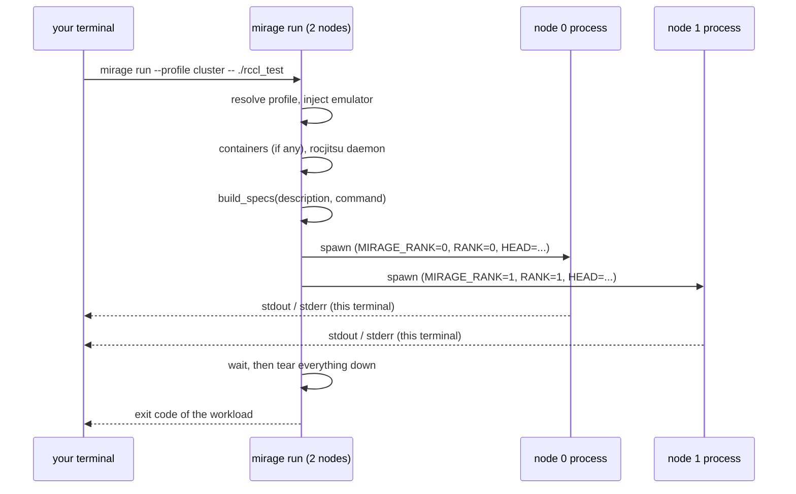

`mirage exec` builds its process grid from the **same** `build_specs`, off the
description the run hands back — so a command behaves identically whichever way
it was started.

---

# What is (and is not) on disk

```console
$ mirage paths
config:   /home/me/.config/mirage
runtime:  /run/user/1000/mirage
profiles: /home/me/.config/mirage/profile
sessions: /run/user/1000/mirage/session
runs:     /run/user/1000/mirage/run
```

- **Config is on disk** — profiles, topologies and agents are documents you
  author, and they outlive every process.
- **Session state is not.** There is no `def.json`, no `health.json`, no pid or
  stdout files: that layout was an IPC channel between processes, and it made
  lifecycle ambiguous — a crashed writer left state that looked live.
- What remains under `session/<id>/` is a **scratch directory for the emulator**,
  because emulator runtimes are configured by path (`rj_config.json`,
  `config_path`, `daemon.sock`). It is removed with the session.
- `run/<session>.sock` is the one socket, and it exists only while its run does.

---

# DEMO 1 — single-node MI350X

```console
$ mirage profile create cdna4 --emulator rocjitsu --agent MI350X
created profile cdna4

$ mirage run --profile cdna4 -- python3 tests/fixtures/ml/tiny_torch.py
mirage: session s-20260616-191636-3b41-0
tiny_torch_ok

$ echo $?
0
```

The workload **inherits this terminal**: stdout and stderr stay separate, so
redirection works and byte-exact output is byte-exact.

```console
$ mirage run --profile cdna4 -- ./app > out.log 2> err.log
$ mirage run --profile cdna4 -- bash          # and this is an interactive shell
```

There is no pseudo-terminal and no forwarding in between — which is exactly why
both of those behave the way you'd expect.

---

# DEMO 2 — a second terminal: `mirage exec`

```console
# Terminal 1 — hold a cluster up with a shell.
$ mirage run --profile cdna4 -- bash
mirage: session s-20260616-191636-3b41-0
bash-5.2$

# Terminal 2 — the run is the only one live, so no id is needed.
$ ls $(mirage paths --json | jq -r .runs)
s-20260616-191636-3b41-0.sock

$ mirage exec -- env | grep -E 'MIRAGE_|ROCJITSU|LD_PRELOAD'
MIRAGE_RANK=0
MIRAGE_HEAD_ADDR=localhost
LD_PRELOAD=/.../lib/librocjitsu.so
ROCJITSU_RUNTIME_DIR=/run/user/1000/mirage/session/s-20260616-191636-3b41-0

$ mirage exec -- python3 probe_gpu.py       # runs in *this* terminal
```

`mirage exec` asks the run one question (`Attach`), then spawns the process
itself, as its own child, holding the socket open as a lease so the run does
not tear the session down underneath it. Use `-s/--session <ID>` when several
runs are up.

---

# DEMO 3 — multi-node RCCL collective

```console
$ mirage profile create cluster --emulator rocjitsu --agent MI450X \
      --num-nodes 2 --gpus-per-node 2
created profile cluster

$ mirage run --profile cluster -- ./all_reduce_perf -b 8 -e 128M
mirage: session s-20260616-193312-3b41-0
[0] #                                          out-of-place
[0] #       size      count   type    time   algbw   busbw
[0]            8          2   float   12.4    0.00    0.00
[0]    134217728   33554432   float   18.7    7.18   13.6
[1] # Avg bus bandwidth : 6.81 GB/s
```

Two **emulated** nodes, a real collective, ranks coordinated through the head
node — all on one machine.

The `[rank]` labelling is the one thing worth knowing here: with several nodes writing
to one terminal, unlabelled output says nothing about who wrote what. Capturing
prefixes every line with its rank — at the cost of stdin, which is closed for
all ranks.

<!--
Numbers are illustrative; the point is the topology + rank wiring works.
-->

---

# DEMO 4 — containerized session

```console
$ mirage profile create boxed --emulator rocjitsu --agent MI350X --num-nodes 2 \
      --image rocm/dev-ubuntu:6.4 --container-provider podman
created profile boxed

$ mirage run --profile boxed -- ./app &
mirage: session s-20260616-200311-3b41-0

$ podman ps --format '{{.Names}}\t{{.Image}}'
mirage-s-20260616-200311-3b41-0-node-0   rocm/dev-ubuntu:6.4
mirage-s-20260616-200311-3b41-0-node-1   rocm/dev-ubuntu:6.4

# ...and when the run is gone:
$ podman ps -a --filter name=mirage- --format '{{.Names}}'
$ podman network ls --filter name=mirage- --format '{{.Name}}'
```

Each node is a container, connected by a per-session network, with the emulated
GPU served from the mirage process outside them. Nothing is detached and nothing
survives: `--rm` plus an owning parent is the whole cleanup story.

---

# DEMO 5 — debugging a crash

A workload dies. mirage gets out of the way and gives you the truth.

```console
$ mirage run --profile cdna4 -- python3 crashy_kernel.py
mirage: session s-20260616-201455-3b41-0
[rj] kernel launch: grid=(1024,1,1) block=(256,1,1)
[rj] code object arch mismatch: gfx942 != gfx950
RuntimeError: HIP error: invalid device function

$ echo $?
1

# stderr is still stderr, so the emulator trace can be kept on its own.
$ mirage run --profile cdna4 -- python3 crashy_kernel.py 2> rj.log
$ grep 'arch mismatch' rj.log
[rj] code object arch mismatch: gfx942 != gfx950
```

The workload's exit code **is** mirage's exit code (masked to a byte, so the
shell's `128 + signal` convention survives). The `[rj]` trace pinpoints the arch
mismatch. Re-run instantly — no cluster queue, no post-mortem archaeology.

---

# DEMO 6 — interrupting a long job

```console
$ mirage run --profile cluster -- python3 long_train.py
mirage: session s-20260616-203901-3b41-0
[0] epoch 3/100  loss=2.14
[1] epoch 3/100  loss=2.16
^C
$ echo $?
130
```

- Ctrl-C reaches **mirage**, not the workload: children lead their own process
  groups, so the terminal's foreground group is the run alone.
- Mirage forwards the signal, then waits — so the workload gets its chance to
  clean up, and the session teardown still runs.
- A **second** Ctrl-C means you are no longer waiting: the processes are
  terminated outright.
- `SIGTERM` takes the same path, so a CI runner cancelling a job doesn't strand a
  container either.

---

# DEMO 7 — the shared emulated GPU

```console
$ mirage run --profile cdna4 -- sh -c \
    'test -S $ROCJITSU_RUNTIME_DIR/daemon.sock && echo DAEMON_SOCKET_PRESENT'
DAEMON_SOCKET_PRESENT

$ mirage run --profile cdna4 -- env | grep -E 'LD_PRELOAD|ROCJITSU'
LD_PRELOAD=/.../_rocm_sdk_devel/lib/librocjitsu.so
ROCJITSU_RUNTIME_DIR=/run/user/1000/mirage/session/s-20260616-204410-3b41-0
```

- The rocjitsu VM is stood up **inside the mirage run process** (in-process FFI
  via `rocjitsu_sys`), and every workload — every node, every `mirage exec` from
  every other terminal — attaches to the same daemon socket.
- Multiple processes → **one** shared emulated GPU, GPU memory via memfds.
- `--in-process` opts out, one VM per workload, no sharing. Useful for isolating
  a single-process bug; not for collectives.

---

# DEMO 8 — drop-in rocjitsu compatibility

Existing `rocjitsu` scripts keep working — mirage is a drop-in.

```console
# Upstream rocjitsu CLI shape:
$ rocjitsu --config cfg.json -- ./app --flag

# Same line, just swap the binary:
$ mirage --config cfg.json -- ./app --flag
# == mirage run --config cfg.json -- ./app --flag
```

A bare invocation with `--` and no recognized subcommand is routed to
`mirage run`. `--attach` maps to `--daemon` (mirage manages the daemon's
lifetime, so "attach to a daemon" and "use a daemon" collapse to the same
opt-in). No script changes required.

---

# Debugging at scale: the test matrix

mirage ships an E2E matrix that is the full cross-product of how teams debug:

| Dimension | Values |
| --------- | ------ |
| **Emulator** | `rocjitsu`, `rocjitsu-dbt` |
| **Containerization** | `node`, `podman`, `docker` |
| **Hardware** | `mi350x`, `mi450x` |
| **Payload** | `tiny_torch` (1 node), `rccl` (2 nodes), `crash` (1 node) |
| **Plugins** | `none`, `race` |

```console
$ cargo test --test matrix_e2e -- --nocapture
mirage testing matrix — 72 combinations

  COMBINATION (emulator+container+hw+payload+plugin)          RESULT
  rocjitsu+node+mi350x+tiny_torch+none                        RAN
  rocjitsu+podman+mi450x+rccl+none                            RAN
  rocjitsu-dbt+node+mi350x+tiny_torch+none                    SKIP (no translation GPU)
matrix summary: 36 ran, 36 skipped, 72 total
```

Every row runs the same lifecycle — **create → run → ensure nothing survived the
run → delete** — and unsupported combos **skip with a reason**, so the suite is
meaningful on a laptop, in CI, and on a real host alike.

---

# Plugins: hazard & race detection

Backends can advertise plugins that turn the emulator into a **bug finder**:

```console
$ mirage profile create checked --emulator rocjitsu --agent MI350X
created profile checked

$ mirage run --profile checked --plugin race -- ./my_kernel
[rj hazard] data race: write @0x7f.. (wave 3) vs read @0x7f.. (wave 7)
[rj hazard]   kernel: fused_attention  line 142
RuntimeError: detected 1 memory hazard
```

Plugins can be enabled per run with `--plugin <name>` or baked into a profile.
Because it's an emulator, it sees **every** memory access — races that are
non-deterministic on real hardware become **reproducible** here.

---

# Why this changes how we debug

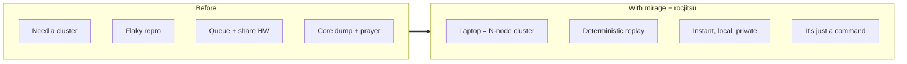

- **Shift left** — catch multi-node bugs before you ever touch real silicon.
- **Democratize** — every engineer gets an MI450X cluster.
- **Ordinary** — a 256-GPU job is a foreground process with an exit code, a
  terminal, and a Ctrl-C. Everything you already know about processes applies.

---

# Recap

- **rocjitsu** = software GPU emulator (interposer + VM, daemon or in-process).
- **mirage** = the UX that runs it **at scale**: profiles, topologies, and one
  command that owns everything it starts.
- **`mirage run` is the runtime** — the session lives in that process and dies
  with it. `mirage exec` borrows it from another terminal.
- **Topology** models the rack; **containers** isolate each node; **rank + head**
  wiring (`MIRAGE_RANK`, `MASTER_ADDR/PORT`, `WORLD_SIZE`) comes for free.
- **`[rank]` labels** appear automatically once a job has more than one
  process, so you always know which rank said what.

```console
$ mirage profile create cdna4 --emulator rocjitsu --agent MI450X --num-nodes 2
$ mirage run --profile cdna4 -- ./your-rocm-app
```

## Questions?

<!--
Close: "Pick a profile, hit run. Your laptop is now a debuggable MI450X cluster,
and Ctrl-C is the cleanup."
-->
