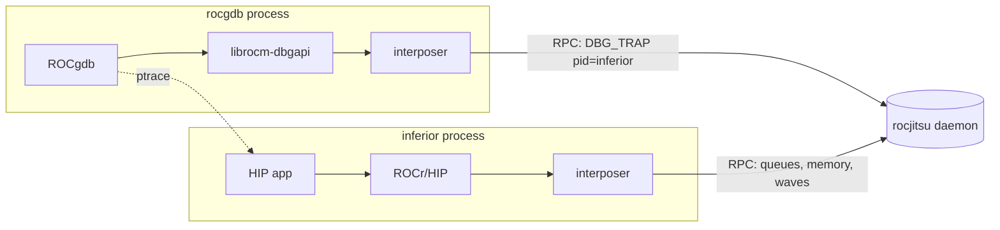

# Debugging emulated GPU kernels with ROCgdb

rocjitsu emulates the AMD KFD closely enough that **real ROCgdb / rocm-dbgapi**
can attach to a workload running on the emulated GPU and debug its kernels — no
physical AMD GPU required. This document explains how the pieces fit together,
how to debug your own kernel, and tracks what is implemented.

All KFD debug behaviour is mirrored from the real driver source
(`amd/amdkfd/{kfd_chardev.c,kfd_debug.c,kfd_topology.c}`, amdgpu-6.16.13),
cross-checked against a physical MI300X and the in-tree `projects/rocdbgapi`.

## 1. How the pieces fit together

ROCgdb does not talk to the GPU directly. It loads `librocm-dbgapi`, which opens
`/dev/kfd` and issues `AMDKFD_IOC_DBG_TRAP` sub-operations against the **pid of
the inferior**; the kernel correlates debugger and inferior by the ptrace
relationship. The emulator has no real `/dev/kfd`, so both processes run under
the rocjitsu LD_PRELOAD interposer and share one rocjitsu **daemon** that hosts
the GPU/wave state.



Local (in-process) mode cannot host ROCgdb: the debugger and inferior would each
get a private `SimulatedDriver`, so the debugger's dbgapi would never see the
inferior's process table. **Daemon mode is mandatory**, and `mirage run` drives
it in one command — it starts the session daemon, runs ROCgdb under the
interposer connected to that session, and ROCgdb launches the inferior into the
same session. The `--gdb` flag wraps the workload for you:

```bash
mirage run --profile mi350x --gdb -- ./my_hip_app
```

is shorthand for `-- rocgdb -ex 'set breakpoint pending on' --args ./my_hip_app`;
drop `--gdb` to pass your own `rocgdb` invocation for full control.

## 2. Debugging your own kernel

1. Compile with device debug info, matching the mirage profile's arch
   (`mi350x` = `gfx950`):
   ```bash
   hipcc --offload-arch=gfx950 -g -O0 -o app app.hip
   ```
2. Run under `mirage run --gdb` — one command drops you into ROCgdb with
   kernel breakpoints already pending:
   ```bash
   mirage run --profile mi350x --gdb -- ./app
   ```
   Script the session with repeatable `--gdb-ex` commands (implies `--gdb`):
   ```bash
   mirage run --profile mi350x --gdb-ex 'break add_one' --gdb-ex run -- ./app
   ```
3. In ROCgdb: `break <kernel>`, `run`. (`--gdb` already applied
   `set breakpoint pending on`, so the kernel symbol resolves at dispatch.)

## 3. Demos

Recorded, runnable walkthroughs live in `emulation/rocjitsu/demos/` (each has a
`.md` explainer, a runnable `.sh`, and an asciinema `.cast`):

| Demo | Shows |
|---|---|
| [rocgdb-quickstart](../demos/rocgdb-quickstart.md) | Debug a GPU kernel with one command; inspect arguments and locals |
| [rocgdb-watchpoint](../demos/rocgdb-watchpoint.md) | Catch which wave writes a buffer with a hardware watchpoint |
| [rocgdb-fault](../demos/rocgdb-fault.md) | Catch a GPU memory-access fault (SIGSEGV) |
| [rocgdb-multiwave](../demos/rocgdb-multiwave.md) | Debug a real multi-wave kernel: both waves, each with its own private data |

Regenerate a `.cast` with `emulation/mirage/scripts/record_demo.sh <demo>.sh`.
That script requires `asciinema` on `PATH` and will not install it for you --
provision it in your container or dev environment (`apt-get install asciinema`,
`pipx install asciinema`).

## 4. Status

Real ROCgdb, driven by `mirage run`, **debugs an emulated GPU kernel end to
end**: it attaches, enumerates the GPU agent, stops at a kernel breakpoint, reads
wave registers / PC / disassembly, single-steps instructions, resolves
source-level arguments and locals from private/scratch memory (`print`,
`info args`), and continues the kernel to correct completion. `info agents` lists
the synthetic `gfx950 / MI350X` agent, a breakpoint on a GPU kernel stops the
trapping wave, and a hardware `watch` on GPU memory traps the wave that accesses
it. Multi-wave kernels are fully supported: `info threads` correlates every
trapped wave to its workgroup and position, and each wave reads its own private
memory.

| Area | Status |
|---|---|
| Topology debug capabilities (`capability`/`debug_prop`) | done |
| `AMDKFD_IOC_DBG_TRAP` dispatcher + validation ladder | done |
| ENABLE / DISABLE + `kfd_runtime_info` | done |
| GET_DEVICE_SNAPSHOT agent enumeration | done |
| Real ptrace authorization + daemon transport | done |
| Debug sessions keyed by inferior pid (attach before connect) | done |
| SET_EXCEPTIONS_ENABLED / SET_FLAGS / launch-mode/override (accept) | done |
| Attach/detach lifecycle (clean detach after inferior exit) | done |
| GET_QUEUE_SNAPSHOT (real queues) | done |
| Wave stop on `s_trap` + CWSR serialization | done |
| Debug events + register write-back (breakpoint stop end to end) | done |
| One-command debugging (`mirage run --gdb` / `--gdb-ex`) | done |
| Deterministic single-step (`stepi`) | done |
| Displaced stepping / step-over (debugger memory reserved) | done |
| GPU address watchpoints (`watch`/`rwatch`/`awatch`) | done |
| Illegal-instruction exception (SIGILL) | done |
| Memory-access violation (SIGSEGV) | done |
| Private/scratch reads (`print`, `info args`) | done |
| Multi-wave workgroup debugging (`info threads`, per-wave scratch) | done |

## 5. Sources

- KFD UAPI: `linux/uapi/kfd_ioctl.h`, `linux/uapi/kfd_sysfs.h` (vendored).
- KFD driver: `amd/amdkfd/{kfd_chardev.c,kfd_debug.c,kfd_topology.c}`
  (amdgpu-6.16.13).
- Client: `projects/rocdbgapi/src/os_driver_kfd.cpp`.
- Hardware cross-check: MI300X sysfs `capability` / `debug_prop`.
