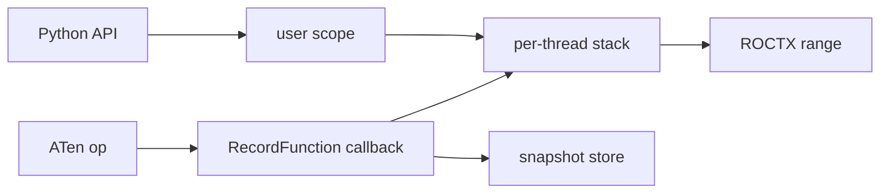

# LLD: torch_trace_collector

## Motivation

rocprofiler-compute attributes GPU kernels to PyTorch operators by emitting a
ROCTX range around each operator. A Python `TorchDispatchMode` can emit ranges
for ATen calls on the current thread, but it does not cover autograd worker
threads or correlate a backward op to the forward call that created it.

PyTorch's `RecordFunction` observer brackets every operator inside the ATen
dispatcher on every thread. Registering a global callback
(`at::addGlobalCallback`) is a C++ API. This module is that callback: it emits
ROCTX ranges, correlates forward and backward ops, and carries Python structural
scopes onto autograd workers.

---

## Overview

`torch_trace_collector` is a pybind11 extension. It registers one process-wide
callback for `RecordScope::FUNCTION` and `RecordScope::BACKWARD_FUNCTION`, keeps
a per-thread marker stack, and exposes install / user-scope / stats entry points
to Python.



| State | Lifetime | Role |
| --- | --- | --- |
| `ThreadState` (`thread_local`) | per thread | marker stack; debug-info guards for user scopes |
| `ProcessState` | per process (per binary) | stats, install handle, snapshot store |
| `SnapshotStore` | process-wide, 64 shards | forward stack keyed by `(seqNr, threadId)` |

---

## Operator path

On entry (`start_cb`):

1. If the thread stack is empty, overlay any user-scope chain from
   `ThreadLocalDebugInfo` (prefix-deduplicated).
2. If the op is `BACKWARD_FUNCTION` with `seqNr >= 0` and a non-zero
   `forwardThreadId`, consume a matching forward snapshot and push it
   (prefix-deduplicated).
3. Push one leaf frame (operator name + leaf context tag).
4. If the op is `FUNCTION` with `seqNr >= 0`, save the current stack under
   `(seqNr, currentThreadId)`.
5. Emit `roctxRangePushA` with the wire string for the full stack, always
   suffixed `|torch`.

On exit (`end_cb`), pop exactly the ROCTX range, leaf, and extra frames recorded
in `RoctxObserverContext` (overlay and snapshot frames share that count).

Leaf context tags (matched literally by analysis):

| Scope | Stack after overlay | Context |
| --- | --- | --- |
| forward | empty | `#1@aten:0` |
| forward | non-empty | `#1@aten.nested:0` |
| backward | `seqNr >= 0` | `#1@autograd.bwd:0` |
| backward | no sequence number | `#1@autograd.engine:0` |

`install()` / `uninstall()` are serialized on `InstallState`. `uninstall()` also
clears the snapshot store.

---

## User scopes and cross-thread context

`push_user_scope(marker, context, backend="")` pushes one frame, publishes the
current stack into `ThreadLocalDebugInfo`, and emits a ROCTX range. A non-empty
`backend` appends `|<backend>`; otherwise the wire string has no backend suffix.
`pop_user_scope` pops the matching frame and range.

PyTorch copies the launching thread's debug info into the autograd graph task
and restores it on the worker. When a worker's stack is empty at op entry, the
callback overlays that chain so structural scopes appear under backward ops.

The debug-info slot is a private string key when the Torch build supports it;
otherwise the build falls back to `TEST_INFO_2`.

---

## Wire format

```text
marker1/.../markerN:context1/.../contextN[|backend]
```

Marker names percent-encode `%` and `/` (`%25`, `%2F`). Contexts are not encoded.
Operator ranges always use `|torch`. Rows without a backend suffix are tagged
`Backend="unknown"` during profile post-processing.

---

## Error handling

- Operator callbacks catch all exceptions, increment `callback_errors`, and do
  not throw into PyTorch. A failed `start_cb` returns a null observer context.
- `push_user_scope` rolls back partial stack/guard updates, counts the error,
  and re-raises to Python. `pop_user_scope` counts and returns on imbalance.

---

## Python API

| Function | Role |
| --- | --- |
| `install` / `uninstall` / `is_installed` | Global callback lifecycle |
| `push_user_scope` / `pop_user_scope` | Structural marker frames |
| `dump_stats` | Counters for tests and diagnostics |

---

## Build and packaging

- `BUILD_TORCH_TRACE_COLLECTOR` (`AUTO` / `ON` / `OFF`) and `TORCH_TRACE_PYTHON`
  control the build. `AUTO` builds when Python and Torch are found.
- The artifact is `torch_trace_collector-<Torch_VERSION>.so`, installed under
  `<libdir>/rocprofiler-compute/`. At runtime the loader selects the artifact
  matching the workload `torch.__version__` (local `+...` suffix removed). A
  mismatch raises an error listing supported versions.
- A static core library links Torch and ROCTX; the pybind module also links
  `torch_python` and `Python3::Module`.

---

## Validation

- gtest: snapshot store, wire round-trip, leaf labels, install/uninstall, scope
  balance, GPU forward/backward runs (ROCTX messages intercepted).
- `dump_stats()`: push/pop balance, snapshot hit rate, callback errors.

## Limitations

- Inductor/Triton launches below `RecordFunction` attribute to the enclosing
  torch scope, not a distinct Triton operator.
- On builds without a private debug-info slot, the shared `TEST_INFO_2` slot
  may collide with other users of that slot.
