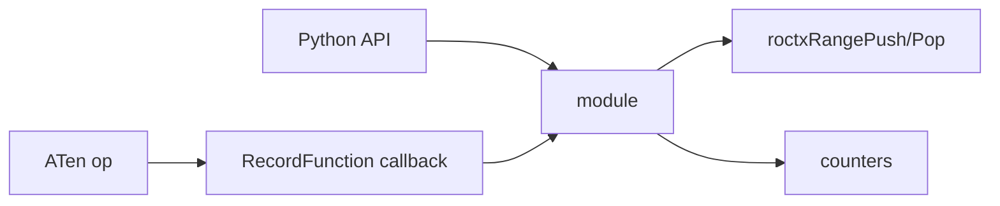
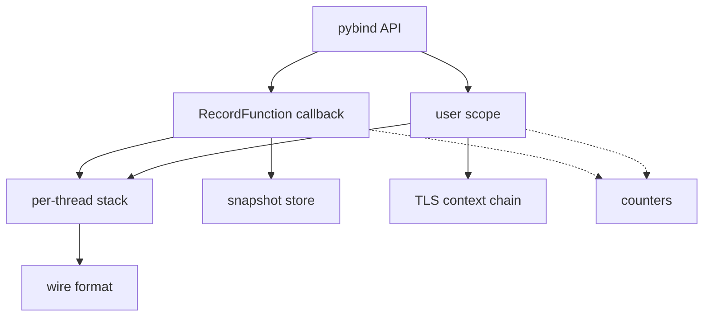
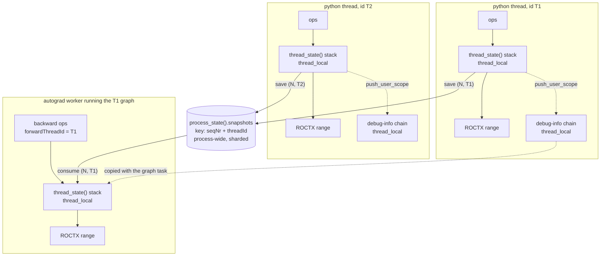
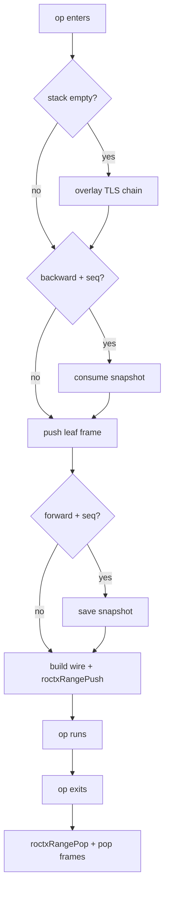
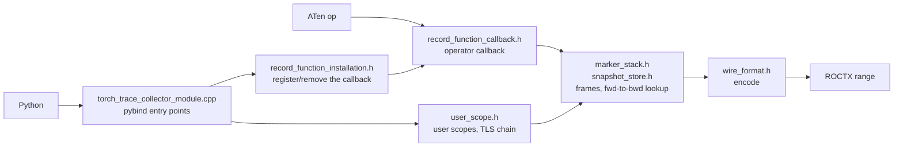
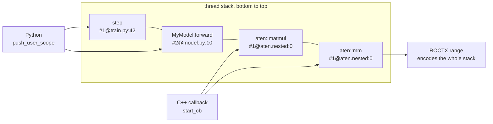
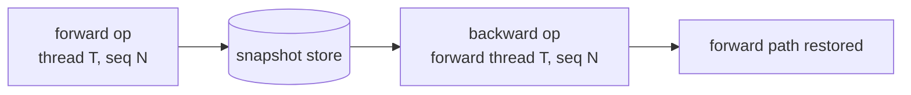
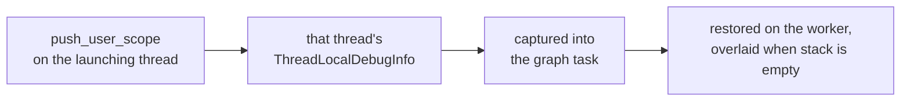

# torch_trace_collector: native RecordFunction tier

## Motivation

A PyTorch workload decomposes into thousands of individual operators such as
`aten::mm`. The GPU kernels rocprofiler-compute captures carry only their own
names: nothing ties a kernel back to the operator, or to the model source line,
that launched it. To close that gap the instrumentation pushes a ROCTX range
around each operator. The ROCm profiler records those ranges alongside the
kernel dispatches in the same run, so analysis can attribute GPU time to
operators and build call trees rooted at a source location.

Ranges can be emitted from Python, and a `TorchDispatchMode` tier does so as a
fallback. That tier is entered per thread and observes only ATen calls, so it
never names the autograd node behind a backward operator and cannot attribute
that operator to the forward call that produced it. Full coverage requires
PyTorch's `RecordFunction` observer, which brackets every operator inside the
ATen dispatcher on every thread. PyTorch exposes `RecordFunction` to Python only
for emitting a range; registering a global observer callback
(`at::addGlobalCallback`) is reachable only from C++, and a per-operator callback
that crossed into Python would acquire the GIL on every operator.

This module supplies that callback. It registers the observer, keeps a
per-thread marker stack, correlates forward and backward operators, and carries
Python-pushed structural scopes across to autograd worker threads.

## Overview

`torch_trace_collector` is a C++ pybind11 extension. It registers a global PyTorch
`RecordFunction` callback that brackets every operator with a ROCTX range, and
exposes a small Python API for lifecycle control and structural markers. This
document specifies the module internals.



### Responsibilities

- Bracket every forward and backward operator, on every thread.
- Attribute a backward operator to the forward call that created it.
- Emit structural markers pushed from Python through the same stack.
- Keep the marker stack balanced and the workload alive on any callback error.

## Concepts and terminology

- **RecordFunction scope** — PyTorch brackets each operator with a scope. The
  module registers for `FUNCTION` (forward/eager ops) and `BACKWARD_FUNCTION`
  (autograd backward ops).
- **User scope** — a structural marker pushed from Python (`push_user_scope`)
  for a region the operator callback does not see, such as a training step or a
  module call.
- **Frame** (`StackEntry`) — one entry on the marker stack: a **marker** (the
  displayed name, e.g. `aten::mm`) and a **context** (`#<n>@<location>`, or a
  fixed leaf tag).
- **Leaf** — the frame the callback pushes for the current op. Its context is a
  fixed tag from `leaf_context.h` (aten top-level, aten nested, autograd
  backward, or autograd engine).
- **Sequence number** (`seqNr`) — PyTorch's op counter, kept per thread.
  Together with the originating thread id it links a forward op to its backward
  op.
- **Wire string** — the encoded stack handed to ROCTX: `markers:contexts`, with
  an optional trailing `|backend`.

## Module layout

State lives in one `ProcessState`, reached through `process_state()`, plus one
`ThreadState` per thread, reached through `thread_state()`. The callback,
user-scope and wire-format layers are stateless functions over them.
`at::addGlobalCallback` registers one callback pair for the whole process and
passes the callbacks no state of their own, so the process-wide half is a single
instance behind an accessor.



- **Per-thread stack** (`thread_local`) — the active marker frames.
- **Snapshot store** — forward stacks held for backward lookup.
- **TLS context chain** — publishes a thread's scope to autograd workers.
- **Wire format** — renders the stack into the pushed marker string.
- **Counters** — push/pop, snapshot, and error tallies for `dump_stats()`.

## Data structures

| Type (file) | Instance | Contents |
| --- | --- | --- |
| `StackEntry` (`stack_entry.h`) | — | one frame: marker name + context string |
| `ThreadState` (`marker_stack.h`) | `thread_state()`, `thread_local` | frame stack + debug-info guards owned by user scopes |
| `RoctxObserverContext` (`record_function_callback.h`) | per op | flags for the range/leaf pushed and snapshot-frame count |
| `ProcessState` (`process_state.h`) | `process_state()` | owns the three members below |
| `Stats` (`stats.h`) | `process_state().stats` | atomic counters |
| `InstallState` (`process_state.h`) | `process_state().install` | callback handle and installed flag, in a `synchronized_t` |
| `SnapshotStore` (`snapshot_store.h`) | `process_state().snapshots` | sharded map (seqNr, threadId) → stack; each shard is a `synchronized_t` over that map plus its LRU list and index |

## Threading model

Every thread instruments itself independently: it owns its marker stack and its
own debug-info chain, and emits its own ROCTX ranges, with no locking on that
path. The snapshot store is the only state the threads share.



- The callback is **global**: one registration fires on every thread that runs
  ops. There is no per-thread install.
- The marker stack (`thread_state()`) is **`thread_local`**, so each thread owns
  its stack and guard vector, needs no locking, and never sees another thread's
  frames.
- Two threads running forward passes concurrently both produce sequence number
  `N`, because PyTorch's counter is per-thread. The **snapshot store** is
  process-wide, so its key carries the thread id as well; the shard is chosen by
  hashing that key and each shard is guarded independently, so saves and consumes
  rarely contend.
- A backward op runs on an autograd worker, not on the thread that built the
  graph. It consumes the snapshot saved by that thread, which it identifies by
  the `forwardThreadId` on its own record.
- User scope reaches a worker by a different route: it is per-thread state that
  travels with the graph task, not shared state (see Cross-thread context).
- **Counters** are atomic; the **install state** and each **snapshot shard** are
  held in a `synchronized_t` (`utils/synchronized`), which hands the guarded
  value to a callable under a read or write lock.

## Stack maintenance

The stack is a `std::vector<StackEntry>` owned by the current thread. Because it
is thread-confined it takes no locks; correctness rests on balanced push/pop.

| Pushed by | Frames added | Popped by |
| --- | --- | --- |
| op entry (`start_cb`) | overlay (if stack empty) + consumed snapshot + one leaf | op exit (`end_cb`) |
| `push_user_scope` | one frame + one debug-info guard | `pop_user_scope` |

- `start_cb` records exactly what it pushed in the op's `RoctxObserverContext`
  (range flag, leaf flag, snapshot-frame count). `end_cb` reads that record and
  pops precisely those frames, so nested ops stay balanced no matter how many
  frames a given op added.
- User-scope frames also push a slot onto a parallel `guards` vector; popping
  the `DebugInfoGuard` un-publishes the chain. The slot is null when the guard
  could not be built, so every user-scope frame has a slot to pop.
- The overlay path uses `push_with_prefix_dedup`, so a chain already present as a
  leading prefix is not duplicated.

## Runtime flow

### End-to-end flow

One operator, from the callback firing to the emitted marker. The entry path
decides which frames to restore, then emits; the exit path unwinds exactly what
was pushed.



### Flow across files

Where the source lives. Operators arrive through the callback and user scopes
through the pybind entry points, but both end up pushing frames onto the same
stack and emitting through the same encoder. Both reach the shared state through
`process_state()` in `process_state.h`.



### Operator capture

The callback registers once for `FUNCTION` and `BACKWARD_FUNCTION` scopes. Each
op pushes a frame and a ROCTX range on entry, and pops both on exit. What was
pushed is stored in the observer context so exit unwinds exactly that (see Stack
maintenance).

How an op is labelled depends on what is already on the stack beneath it. The
link back to the application comes only from user-scope frames, whose context is
the `file:line` of the nearest frame outside the framework and this package;
those frames are pushed by the Python tier's structural wraps around
`nn.Module.__call__`, optimizer steps, `Tensor.backward`, collectives and
similar entry points. An op therefore arrives with an empty stack only when
neither another operator nor a user scope is open on the thread, which is the
case for tensor work outside all of those wraps: setup, data preparation, or
ad-hoc math in the script. Emptiness is judged after the overlay, so an op on an
autograd worker that inherited a chain counts as enclosed.

The leaf frame's context is one of four fixed tags, chosen from the op's scope
and that emptiness. Downstream parsers match these tokens literally, so the
mapping is part of the contract:

| Scope | Condition | Leaf context |
| --- | --- | --- |
| forward | stack is empty | `#1@aten:0` |
| forward | stack is not empty | `#1@aten.nested:0` |
| backward | has a sequence number | `#1@autograd.bwd:0` |
| backward | no sequence number (engine-internal) | `#1@autograd.engine:0` |

The tags imitate the `#<n>@<location>` shape of a user-scope context so every
frame parses the same way downstream. A leaf tag never carries a location of its
own, so `#1@aten:0` is a placeholder: such an op is still recorded and its
kernels still attribute to that operator, but nothing roots them at a line of
the model.

`install()` is idempotent and serialized by the `synchronized_t` holding the
install state; `uninstall()` removes the callback. Both track a single handle.
`uninstall()` also clears the snapshot store: with no callback left to consume
them, snapshots from a forward whose backward never ran would be held for the
life of the process.

### Worked example

One stack holds frames from both producers, and nesting is just stack depth.
Two Python scopes around two nested ATen ops give four frames:



Each of the four pushes emitted its own range, so the ranges nest and all four
are open at once. The innermost one reads:

```text
step/MyModel.forward/aten::matmul/aten::mm:#1@train.py:42/#2@model.py:10/#1@aten.nested:0/#1@aten.nested:0|torch
```

Three properties make this readable downstream. Markers and contexts are
positional, so the nth marker pairs with the nth context. Only the leaf is new
on any given push; the frames below it are whatever the enclosing scopes and ops
already left on the stack, which is why a C++ op inherits a Python scope's
source location without either side knowing about the other. And both ATen
frames are tagged `aten.nested:0` rather than `aten:0`, because the user-scope
frame beneath them means the stack was not empty.

## Forward-to-backward correlation

A forward op saves its stack keyed by the autograd node it created. The backward
op looks up the same key and consumes the snapshot, rebuilding the forward path
before it emits.



The key is the pair (sequence number, thread id). PyTorch's sequence counter is
per-thread and restarts at zero, so concurrent forward passes produce the same
numbers and the number alone does not identify a node. The backward record
carries the id of the thread that built the node (`forwardThreadId`), which is
the id the forward op saved under. A backward record without that id is left
uncorrelated.

The store is sharded (fixed shard count, one lock per shard) so concurrent threads
rarely contend; the shard is chosen by hashing the whole key. Each shard has a
soft cap and evicts its oldest entry (LRU), which bounds memory when backward
never runs (for example detached forward).

## Cross-thread context

Autograd runs backward on worker threads, which do not inherit the launching
thread's stack. `push_user_scope` publishes the current chain into that thread's
own `ThreadLocalDebugInfo`. When backward is launched PyTorch captures the
launching thread's debug info into the graph task and restores it on the worker
that runs that graph, so the chain travels with the work rather than through
shared state. Whenever a thread's stack is empty at op entry (every top-level op
on a worker, since it drains after each op), the callback overlays that chain; a
matching leading prefix is skipped so it is not duplicated.



The debug-info slot is a private string-keyed slot when the PyTorch build
supports it, otherwise a built-in slot detected at build time.

## Wire format

A stack renders as `markers:contexts`, frames joined by `/`, followed by an
optional `|backend` suffix. `%` and `/` within a marker name are percent-encoded
(`%25`, `%2F`) so a name cannot be misread as a separator; contexts are not
encoded. The analysis decoder reverses this, verified by a round-trip test.

Operator ranges always append `|torch`. A user scope appends `|<backend>` only
when the caller passes a non-empty backend, and the binding defaults it to the
empty string, so `push_user_scope("step", "#1@x")` emits `step:#1@x`. Consumers
must tolerate the missing field: `_parse_function_backend` in
`utils/utils_profile.py` tags such rows `Backend="unknown"`.

## Error and lifetime safety

- Each operator callback runs in a single `try/catch(...)`; a caught error is
  counted in `callback_errors` and does not propagate.
- `Expects` (`utils/gsl_assert`) states the invariants a callback cannot recover
  from: the snapshot store's eviction precondition and its LRU index. A violation
  throws and is then caught and counted like any other error, so the never-throw
  contract towards PyTorch holds. Conditions a caller can provoke stay counted
  `catch(...)` sites instead, since that count is reported at the end of the
  workload.
- A partial push in `start_cb` unwinds through a scope guard, so a mid-push
  failure leaves the stack balanced. `push_user_scope` orders its work so that
  everything able to throw happens before `roctxRangePushA`; its two rollbacks
  therefore cover the whole window in which a failure is possible, and the range
  push itself needs no guard. It counts the error and re-raises to Python;
  `pop_user_scope` counts and returns.
- The accessors return function-local statics, so every translation unit in a
  binary reaches the same instance. The guarantee is per-binary: the pybind
  module and the test executable link the static core library into separate
  images and share no state. `thread_state()` adds `thread_local`, so it is one
  instance per thread.

## Python API

| Function | Purpose |
| --- | --- |
| `install` / `uninstall` / `is_installed` | Manage the global callback |
| `push_user_scope` / `pop_user_scope` | Emit a structural marker frame |
| `dump_stats` | Return counters for debugging |

## Build and packaging

- `BUILD_TORCH_TRACE_COLLECTOR` decides whether the extension is built. `AUTO`
  builds it when Python and Torch are found, and reports why it is skipped
  otherwise; `ON` makes an absent torch a configure error;
  `OFF` skips the directory. Any other value stops the configure.
  `TORCH_TRACE_PYTHON` selects the interpreter, defaulting to the one CMake finds.
- CMake locates the interpreter with `find_package(Python3)` and the wheel with
  `find_package(Torch CONFIG)`. That lookup may enable the HIP language. Includes
  come from `TORCH_INCLUDE_DIRS`. `torch`, `torch_cpu`, `c10`, and `torch_python`
  are resolved under `${TORCH_INSTALL_PREFIX}/lib`.
- The artifact is named `torch_trace_collector-<torch-version>.so`, using
  `Torch_VERSION` from `find_package(Torch)`. At runtime the loader loads the
  artifact that matches the workload `torch.__version__` (local `+...` suffix
  removed) from `<prefix>/lib*/rocprofiler-compute/`, or from
  `src/lib/_build/lib/` when that file is not installed. A mismatch raises an
  error listing the supported versions and the workload version.
- A static core library carries the shared source and its usage requirements, the
  torch and roctx includes and libraries, `synchronized`, `gsl_assert`, and the
  debug-info flag, and both the pybind11 `MODULE` and the gtest binary link it and
  inherit them. The C++ ABI is left to the toolchain default, which already
  matches what ROCm libtorch is built with. The filename does not encode an ABI.
- `torch_python` is resolved separately and linked only into the pybind module. It
  leaves Python symbols undefined and names no `libpython` of its own, so only a
  consumer already loaded by an interpreter can resolve them.
- A compile check selects the debug-info slot.
- The collector directory is registered from `src/lib/CMakeLists.txt`. The
  module omits the `lib` prefix, is named by PyTorch version, and is installed
  to `<libdir>/rocprofiler-compute/` as `TORCH_TRACE_COLLECTOR_TARGET`. The
  gtest is added when `ENABLE_TESTS` is on and `gtest_main` exists; the
  directory publishes `ROCPROF_TEST_LD_LIBRARY_PATH` and the root
  `CMakeLists.txt` registers the test.

## Validation

- **gtest** — snapshot store (save/consume, one-shot, LRU eviction, per-shard,
  concurrency, cross-thread key isolation), wire encoding round-trip, leaf
  labels, install/uninstall, scope balance, and real forward/backward runs on
  GPU. The gtest records each `roctxRangePushA` message.
- **Counters** — `dump_stats()` surfaces push/pop balance, snapshot hit rate,
  and callback errors.

## Limitations

- On newer PyTorch/ROCm the Inductor static launcher runs Triton kernels below
  the RecordFunction layer, so those kernels attribute to the enclosing torch
  scope rather than a distinct Triton operator.
- The built-in debug-info slot used on older builds is shared with any other
  debug-info user in the process.
